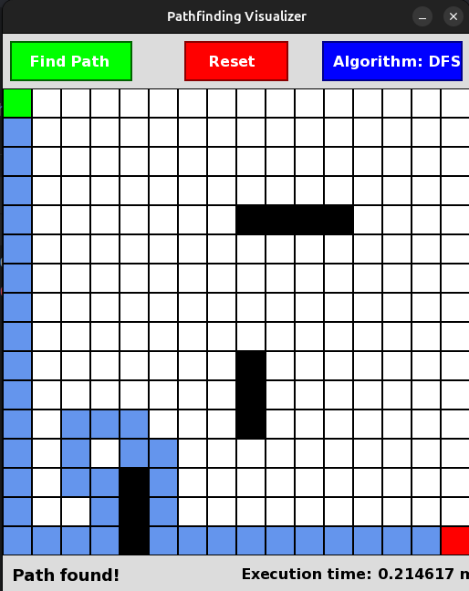
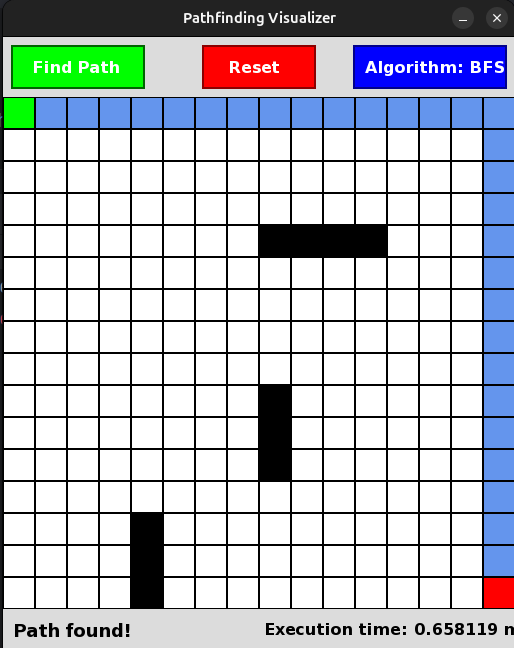
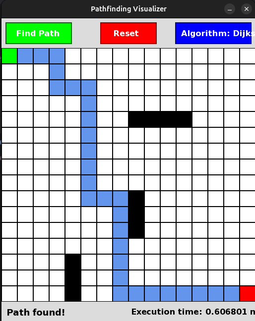

# Dynamic-Path-finding-Visualizer

## Desktop representation for pathfinding algorithms (DFS | BFS | Dijkstra)
The tool visualizes pathfinding algorithms by showing the path from the start to the goal on a grid and the time taken for each algorithm.

### Pathfinding Algorithms:
- **DFS** (Depth-First Search)
- **BFS** (Breadth-First Search)
- **Dijkstra's Algorithm**

---

1. **DFS Algorithm**  
   

2. **BFS Algorithm**  
   

3. **Dijkstra Algorithm**  
   

### How to Use
- Select the algorithm you want to visualize.
- Click on the grid to set the start and goal points.
- The path will be shown along with the time taken for the algorithm to find the path.
